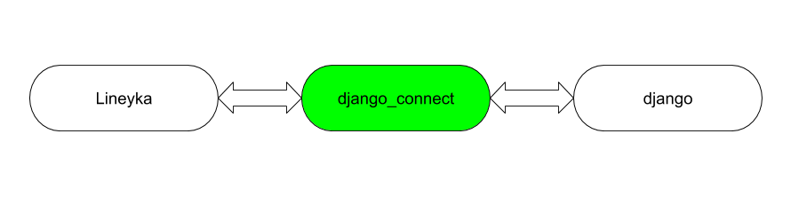

.. data-exchange-page:

Data Exchange
=============

Обмен данными с линейкой через модуль :ref:`django_connect-page`.

Arist
-----

* Локальное хранение данных юзера в формате ``django`` в файле :attr:`edit_db.studio.USER_DATA_FILE_NAME`

* Конвертирование данных в формат линейки при инициализации экземпляра в процедуре :func:`edit_db.artist.init_by_keys`

Data to Lineyka
---------------

На стороне django
~~~~~~~~~~~~~~~~~

* :func:`edit_db.shortcuts.inst_to_json` 
	* объект джанго в словарь,
	* удаление лишних полей,
	* ``uuid`` в ``hex`` (для ``id``).
	* дату/время из *utc* в местное время пользователя. ``!!!! сделать``
	* преобразование словаря в строку.

На стороне Lineyka
~~~~~~~~~~~~~~~~~~

* :func:`django_connect._input_data_converter`
	* подробности в описалово.

Data to django
--------------

На стороне Lineyka
~~~~~~~~~~~~~~~~~~

* :func:`django_connect._output_data_converter`
	* подробности в описалово.

На стороне django
~~~~~~~~~~~~~~~~~

* :func:`edit_db.shortcuts.json_to_inst` 
	* строку в словарь *json.loads()*,
	* ``hex`` в ``uuid`` (для ``id``),
	* дату/время из местного пользовательского в *utc* . ``!!!! сделать``.