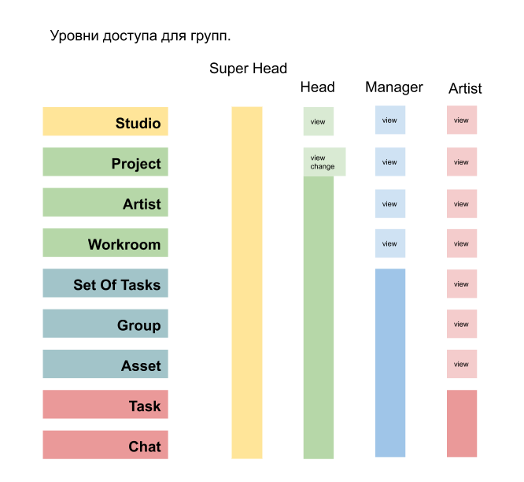

.. _django-levels-page:

Levels
======

.. _super_head_level:

Super Head
----------

Имя группы
~~~~~~~~~~

**<studio_name>_superhead**

Доступы
~~~~~~~

Для всех моделей: ``add``, ``change``, ``delete``, ``view``

.. _head_level:

Head
----

Имя группы
~~~~~~~~~~

**<studio_name>_head**

Доступы
~~~~~~~

* **Studio** : ``view``.

* **Project** : ``change``, ``view``.

* **Artist** : ``add``, ``change``, ``delete``, ``view`` .

    .. note:: 

        * Только на поля моелей ``StudioMembers``, ``WrMembers`` и на ``auth.models.Group``.
        * Ставить проверку всем приложениям меняющим эти модели: членство в студии, отделе, в группе.
        * Изменение членства в группе `Super Head`_ может только член этой группы. ``????`` Проработать.

* **Workroom** : ``add``, ``change``, ``delete``, ``view``.

* **SetOfTasks** : ``add``, ``change``, ``delete``, ``view``.

* **Group** : ``add``, ``change``, ``delete``, ``view``.

* **Asset** : ``add``, ``change``, ``delete``, ``view``.

* **Task** : ``add``, ``change``, ``delete``, ``view``.

* **Chat** : ``add``, ``change``, ``delete``, ``view``.

.. _manager_level:

Manager
-------

Имя группы
~~~~~~~~~~

**<studio_name>_manager**

Доступы
~~~~~~~

* **Studio** : ``view``.

* **Project** : ``view``.

* **Artist** : ``view`` .

* **Workroom** : ``view``.

* **SetOfTasks** : ``add``, ``change``, ``delete``, ``view``.

* **Group** : ``add``, ``change``, ``delete``, ``view``.

* **Asset** : ``add``, ``change``, ``delete``, ``view``.

* **Task** : ``add``, ``change``, ``delete``, ``view``.

* **Chat** : ``add``, ``change``, ``delete``, ``view``.

.. _user_level:

User
-------

Имя группы
~~~~~~~~~~

**<studio_name>_user**

Доступы
~~~~~~~

* **Studio** : ``view``.

* **Project** : ``view``.

* **Artist** : ``view`` .

* **Workroom** : ``view``.

* **SetOfTasks** :  ``view``.

* **Group** : ``view``.

* **Asset** : ``view``.

* **Task** : ``add``, ``change``, ``delete``, ``view``.

* **Chat** : ``add``, ``change``, ``delete``, ``view``.

.. note:: 

    * Структура ``codename`` доступа состоит из имени студии, модели и разрешения: *<studio_name>_<model_name.lower>_<perm>*.\
     Например ``codename`` для добавления ассета в студии *disney* будет таким: *disney_asset_add*
    * Параметр ``code`` передаваемый в :func:`edit_db.permissions.permission_required` должен иметь структуру: *<model_name.lower>_<perm>*, например: *asset_add*.